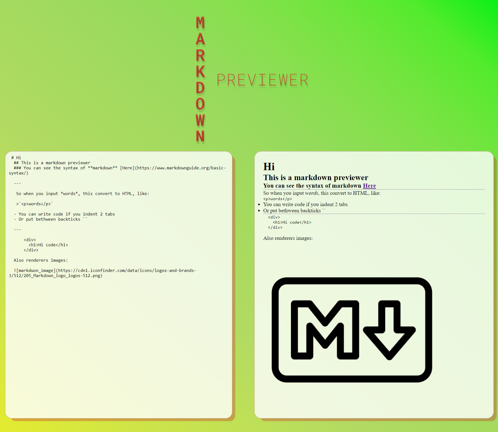
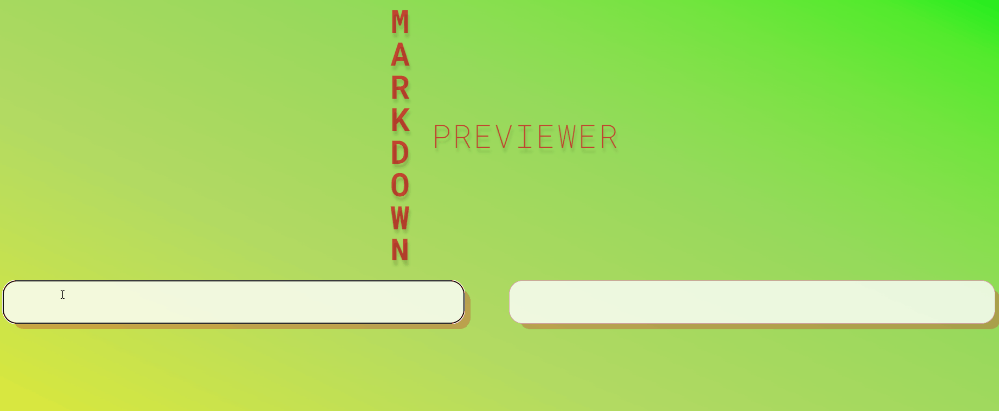

# React Markdown Previewer  

### This is a React Markdown Previewer project for the Front End libraries Certification of Freecodecamp:

This Project was made using Babel Compiler to convert to JSX syntax. Also uses the Marked librarie to parse the Markdown syntax to proper HTML and display it on the page.

The link of both:
[Marked](https://cdnjs.cloudflare.com/ajax/libs/marked/4.0.0/marked.min.js)
[Babel](https://unpkg.com/@babel/standalone/babel.min.js)  

## The Design:  

  
  

