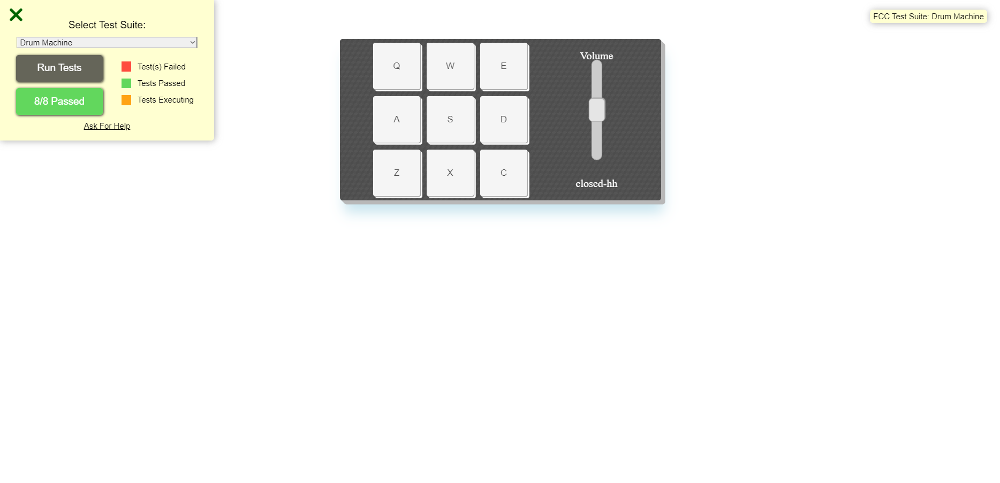

# Bateria Eletrônica React



Neste projeto foi utilizado o Vite para inicilizar o template básico, e agora sim podemos dizer que é um verdadeiro project react, com direito a build e tudo mais!!
O vite é uma ferramenta para gerar estrutura de código bem popular (e principalmente, rápida) podendo gerar templates para React, Vue, Angular etc...

Esse projeto é uma bateria eletronica com 9 botões e um slider para regular o volume dos sons tocados e um display que mostra a descrição do audio tocado.

Sobre a estrutura do código em si, utilizei agora componentes funcionais e os hooks `useState()` para ter a mesma funcionalidade de um componente de classe! Definitivamente um grande avanço no aprendizado, por diminuir o boilerplate de código a ser digitado, além de deixar mais organizado e limpo!  

Também comecei a tentar modularizar o código em componentes mas ainda sem muita prática!

O projeto consiste em um componente `<ButtonsPads />` com 9 botões cada qual com seus events handler Onclick que chama uma função passada como uma prop da raiz App.jsx que toca a tag `<audio>` filha do botão clicado, além de pegar o valor do slider de volume para definir o volume do som, chamar uma outra função para mudar o estilo do botão temporariamente e definir o display com a descriçao do audio, através de um state `description`:
```
  function play(e) {
    let volume = document.getElementById('volume');
    e.target.firstElementChild.volume = parseFloat(volume.value) / 100
    e.target.firstElementChild.play();
    setDescrition(e.target.id);
    changeClass(e.target);
  }
```

Também é implementada o listener de evento em keydown, já que cada botão e audio tem uma tecla respectiva no teclado. Para essa funcionalidade lembro de ter encontrado bastante dificuldade para implementá-la, mas encontrei a solução ao fazer um loop para todos os audios ao chamar a função, que procura o ID do audio (que é a string da tecla) e compara com a tecla pressionada, caso seja,  o respectivo audio é tocado, o estilo é acionado e o state atualizado.
Uma tag audio:
>`<audio src='https://s3.amazonaws.com/freecodecamp/drums/Heater-1.mp3' className='clip' id='Q'>`

A função:
>```
>  function handleKey(e) {
>    let volume = document.getElementById('volume');
>    const keyPressed = e.key.toUpperCase()
>    const audios = document.querySelectorAll('audio.clip')
>    audios.forEach(audio => keyPressed === audio.id ? audio.volume = parseFloat(volume.value) / 100 : null)
>    audios.forEach(audio => keyPressed === audio.id ? audio.play() : null)
 >   audios.forEach(audio => keyPressed === audio.id ? setDescrition(audio.parentElement.id) : null)
>
>    audios.forEach(audio => keyPressed === audio.id ? changeClass(audio.parentElement) : null)
>
>  }
>```

Um detalhe importante é que primeiramente eu tentava adicionar o listener keydown em cada botão, mas o foco do cliente atrapalhava completamente o evento, já que eu lidava com `event.target` por exemplo. A solução foi colocar esse listener no próprio `document`, onde independente do foco, ao fazer um loop testando cada audio, não haveria problema de execução no som!!


Confesso que na época lembro desse projeto ter me dado dor de cabeça e me deixou desanimado (principalmente quando tentava adicionar essa funcionalidade `keydown` e não conseguia), mas definitivamente foi um grande degrau no meu aprendizado, por lidar com uma estrutura de código diferente, event handler e targets onde não havia prática (a parte do `useState` foi molezinha). Mesmo também sendo um projeto simples, definitivamente solidificou muito aprendizado, e hoje lidar com os mais diferentes tipos de eventos também pe arroz com feijão!


#### O app está disponivel online no vercel para quem quiser testar live:
<span><a href="https://drum-machine-ngky7x5sp-lucas-vieira-r.vercel.app" target="_blank">Projeto Live</a></span>
