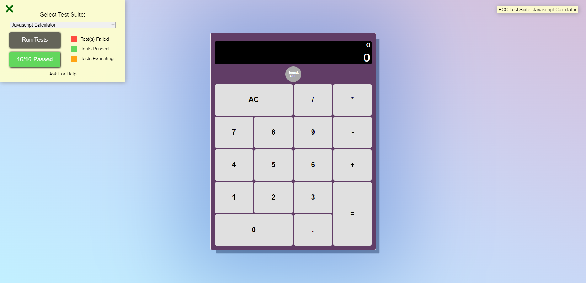

# Calculadora React

### Vos apresento a tão famigerada calculadora, projeto presente no portfolio de todo dev, mas nenhuma tão bonita quanto a minha! Nossa como ela ficou linda !!!



Nesse projeto como já tinha uma boa experiência no básico de React tive a audácia de tentar compor esse App com váarios componentes e tentar modularizar ela, pra ficar tudo organizado.

Já bem consolidado minha expertise com eventos após a bateria, principalmente botões, achei bem tranquilo usar o `useState()` para o display da sentença matematica, e para resolver a sentença utilizei uma biblioteca `Math.js` que facilitou muito a minha vida, resolvendo as strings em resultado numérico.

E pronto!!! 

...Só que não!

Esse projeto faz parte da certificação de bibliotecas de desenvolvimento frontend do Freecodecamp, e é preciso passar nos testes disponibilizados... e como haviam testes:

- Não podem haver zeros a esquerda
- Dois pontos decimais em um numero também não são permitidos
- Operadores clicados em sequencia, devem na verdade trocar o o operador anterior, menos no caso do negativo (-) já que números negativos existem.
- Ao clicar no (=) o resultado deve aparecer e eu posso continuar as sentenças utilizando ele, caso na sequencia eu clique em um operador.
- Devem conter dois displays, um para a sentença inteira, outro para o ultimo numero digitado

Entre outros...

Fui lidando com cada problema a medida que ia implementando uma grande função (grande mesmo):

```
    const add = function(e) {
        if(soundPower==='ON'){
            playSound()
        }
        let str = e.target.innerHTML;
        // usei split para conseguir separar os numeros da sentença pelos operadores
        let sentenceArray = sentence.split(/[\+\-\*\/]/);
        //salvei o ultimo numero para checar a troca de sinais
        let lastChar = sentence.slice(-1);
        //e tambem o anterior a ele para alterá-lo casa houvesse
        let twoLastChar = sentence[sentence.length-2];

        // checagem para nao haver dois pontos decimais
        if (str === '.' && (sentenceArray[sentenceArray.length -1].includes('.') || actualValue.includes('.'))) {
            return;
        }
    
        //checando operadores para não repeti-los em sequencia, e sim troca-los
        if(str === '/' || str === '*' || str === '+' || str === '-') {
            //menos no caso do negativo pois numeros negativos existem
            if(str==='-' &&(lastChar === '/' || lastChar === '*' || lastChar === '+')){
                setSentence(sentence + str);
                setBoolean(false)
            }
            // mas caso um operando seja digitado após o negativo,a troca deve ocorrer, substituindo os dois anteriores casho haja
            else if(lastChar === '-' && (str === '/' || str === '*' || str === '+') && (twoLastChar==='/'||twoLastChar==='*'||twoLastChar==='+')){
                setSentence(sentence.slice(0,-2) + str)
                setBoolean(false)
            } // ou só o negativo
            else if (lastChar === '-' && (str === '/' || str === '*' || str === '+')) {
                setSentence(sentence.slice(0,-1) + str)
                setBoolean(false)
            // substituindo operadores normalmente, trocando um pelo outro
            } else if(lastChar === '/' || lastChar === '*' || lastChar === '+') {
                setSentence(sentence.slice(0,-1) + str)
                setBoolean(false)
            } else {
                setSentence(sentence + str);
                setBoolean(false)
            }
            setActualValue("0");
            setBoolean(false)

        //aqui para fazer a chacagem para ser capaz de continuar o calculo com o resultado anterior
        }else {
            if(resultIsDisplayed && (str==='0'||str==='1'||str==='2'||str==='3'||str==='4'||str==='5'||str==='6'||str==='7'||str==='8'||str==='9')){
                setBoolean(false)
                setSentence(str)
                setActualValue(str)  
            }else{
                setSentence(sentence === '0' ? str : sentence + str);
                setActualValue(actualValue === '0' ? str : actualValue + str);
                setBoolean(false)
            }

        }
    }
```
Essa função lida com cada caso acima para implementar o state `sentence` como string que depois, ao ser chamada outra função é resolvida como expressão matematica:
```
    const equals = function(e){
        if(soundPower==='ON'){
            playSound()
        }
        setBoolean(true)
        let result = evaluate(sentence)
        setActualValue(result.toString())
        setSentence(result.toString())
       
        
    }
```
E claro, há a funcionalidade de sons ao teclar, que pode ser ligada ou desligada.

Um aprendizado novo foi renderizar componentes usando a função map para um array, onde assim renderizei todos os botôes com apenas uma linha, e isso com seus event handler respectivos, ids, classes etc:
```
    const values = [{'value':'AC','id':'clear','onclick':clear,'divId':'Clear'},
                    {'value':'/','id':'divide','onclick':add,'divId':'Divide'},
                    {'value':'*','id':'multiply','onclick':add,'divId':'Multiply'},
                    {'value':'7','id':'seven','onclick':add,'divId':'Seven'},
                    {'value':'8','id':'eight','onclick':add,'divId':'Eight'},
                    {'value':'9','id':'nine','onclick':add,'divId':'Nine'},
                    {'value':'-','id':'subtract','onclick':add,'divId':'Subtract'},
                    {'value':'4','id':'four','onclick':add,'divId':'Four'},
                    {'value':'5','id':'five','onclick':add,'divId':'Five'},
                    {'value':'6','id':'six','onclick':add,'divId':'Six'},
                    {'value':'+','id':'add','onclick':add,'divId':'Add'},
                    {'value':'1','id':'one','onclick':add,'divId':'One'},
                    {'value':'2','id':'two','onclick':add,'divId':'Two'},
                    {'value':'3','id':'three','onclick':add,'divId':'Three'},
                    {'value':'=','id':'equals','onclick':equals,'divId':'Equals'},
                    {'value':'0','id':'zero','onclick':add,'divId':'Zero'},
                    {'value':'.','id':'decimal','onclick':add,'divId':'Decimal'}]

  return (
    <div id='ButtonsGrid'>
        {values.map(value => <div className='buttonDiv' id={value.divId}><button id={value.id} onClick={value.onclick}>{value.value}</button></div>)}
    </div>
  )
```

Agora um problema que passei nesse projeto (e só fui descobrir que era um problema no próximo projeto, onde resolvi) foi o prop drilling...

Eu defini os States no componente CalculatorApp e tive que passá-los primeiramente para o Display e ButtonsGrid (ambos componentes filhos) e depois passá-los para os filhos do ButtonsGrid...
```
    *states here*
<CalculatorApp>
    <Display  sentence={sentence} setSentence={setSentence} actualValue={actualValue} setActualValue={setActualValue} resultIsDisplayed={resultIsDisplayed} setBoolean={setBoolean} soundPower={soundPower}  />
    <ButtonsGrid  sentence={sentence} setSentence={setSentence} actualValue={actualValue} setActualValue={setActualValue} resultIsDisplayed={resultIsDisplayed} setBoolean={setBoolean} soundPower={soundPower} >
        <Buttons  sentence={sentence} setSentence={setSentence} actualValue={actualValue} setActualValue={setActualValue} resultIsDisplayed={resultIsDisplayed} setBoolean={setBoolean} soundPower={soundPower}  />
    </ButtonsGrid>
</CalculatorApp>
```
Perceba como eu passo prop atras de prop em todos os componentes... Prop Drilling

Ter uma calculadora no portfolio é definitivamente clichê... Mas o aprendizado que se tem após desenvolver uma, independente de tecnologia usada, é muito proveitoso. Lidar com manipulação de string nesse projeto foi bastante complexo mas também recompensador e a experiência adquirida vale a pena...

### Veja o projeto em produçao:
[Calculadora bonita](https://react-calculator-free-code-camp-hxfny1mtb-lucas-vieira-r.vercel.app)

_Menção honrosa ao design dessa calculadora com direito a gradiente no background, paleta de cores escolhida a dedo e box shadow na medida_


