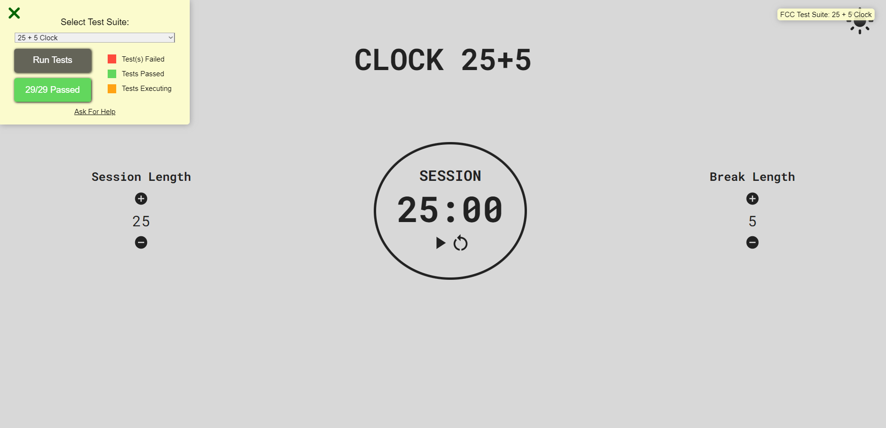
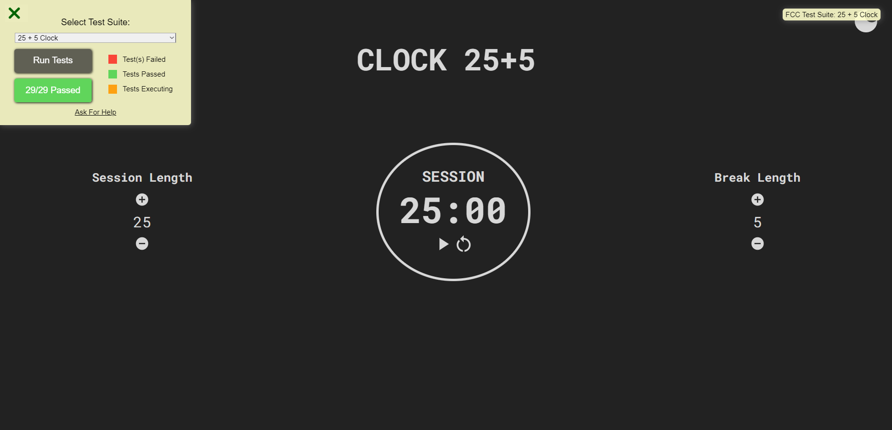

# Pomodoro App



## Na área da tecnologia com tanta novidade para estudar e aprender, manter a produtividade e constância através da gestão do tempo é uma habilidade tremendamente essencial, principalmente para os autodidatas (eu). Então há maneira melhor de gerir o próprio tempo do que gastar horas e mais horas tentando criar um app de técnica pomodoro (kinda) bem bonito?

### A técnica Pomodoro promete dar um up da produtividade do dia dia através de sessões de foco de 25 minutos e uma pausa de 5, e assim por diante... e pra quem acha que essa divisão de tempo não é pra todo mundo, esse projeto permite que o usuário escolha o tempo de foco e o tempo de intervalo!

Com toda certeza esse é meu projeto preferido até o momento, um App com funcionalidades customizáveis da técnica pomodoro, tema dark/light, animações nos botôes, e sem nenhum problema de usabilidade, além de ter um design minimalista lindo que encaixa com qualquer perfil!



No projeto anterior, o da calculadora, eu falei que havia passado pelo temerável problema do Prop Drilling... e nesse projeto implementei uma tecnologia React que acabou com esse problema além de deixar o código mais organizado e bem legível: a Context API!

Um contexto no React é estruturado para compartilhar globalmente atributos, funções, states (e temas também!) etc... sem a necessidade de ficar passando props pra la e pra cá, e ele funciona assim:
```
// cria um contexto a ser importado e usado depois com o useContext() nos outros componentes:
const AppContext = createContext()

// cria uma função para ser onde toda a lógica estará inserida:
function AppProvider(props){

    *Lógica aqui

    // retorna uma tag com o atributo Provider (pois irá prover tudo para o que estiver dentro dela):
    return(
        <AppContext.Provider value={{*variaveis, *funções, *states}}>
            // props.children significa que estamos passando os filhos desse componente como props dele mesmo, para que assim eles tenham acesso aos valores passados!
            {props.children}
        </AppContext.Provider>
    )
}
```

E é simples assim, agora nos outros componentes:
```
import { useContext } from 'react'
import { AppContext } from '../context/appContext'

    const session = useContext(AppContext)
    // para acessar tudo passado no Provider e só usar a variável criada:
    session.incrementTimer()
```
Agora como esse projeto funciona é bem simples, eu utilizei o hook `useEffect()` que chama uma função `decrementtimer()` que decrementa um segundo e possui toda a lógica para não haver segundos negativos.

O hook `useEffect()` é usado para lidar com efeitos colaterais no ciclo de vida dos componentes, onde uma callback é executada por exemplo quando um componente se atuliza, ou ao inicializar... E básicamente a função tick é, se o cronometro nao tiver zerado, um segundo é decrementado ( e ao decrementar o segundo, componentes são atualizados chamando novamente a função até chegar no 0 ou o usuário pausar):
```
    useEffect(()=>{
        /*-------------------------start the clock--------------------------------------*/
        if(powerOn){
            let tick = setInterval(decrementTimer,1000)
            return ()=>clearInterval(tick)
        }else{
            clearInterval()
        }
    },[sec,powerOn])
```
Esse projeto foi o que eu mais gostei de fazer, pois já tinha adquirido bastante experiência com React e já possuia prática nos hooks (`useState()` e `useEffect()`), já havia também implementado a Context API em projetos mais simples de cursos, e principalmente porque eu já tinha feito um cronometro em JS Vanilla (inclusive reciclei umas partes de código...). Mas definitivamente concretizar todo esse aprendizado num projeto com um ambiente de testes me formou um desenvolvedor melhor e mais limpo.


#### Deploy do projeto disponível em:

[Pomodoro](https://clock-25-5-5gz8yji7a-lucas-vieira-r.vercel.app)


