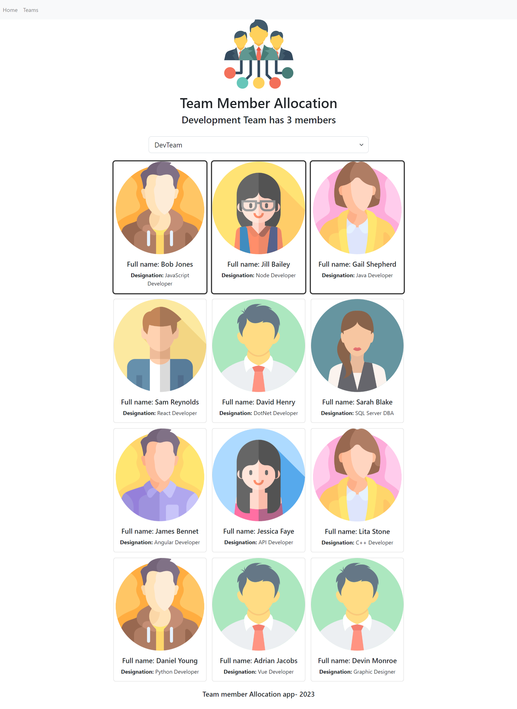
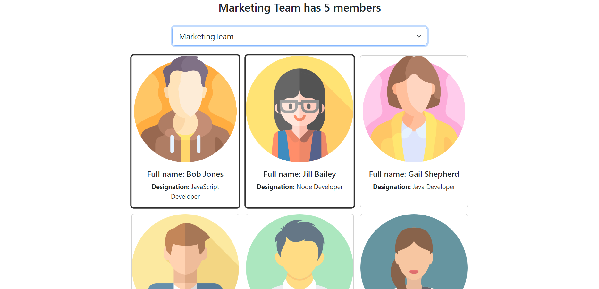
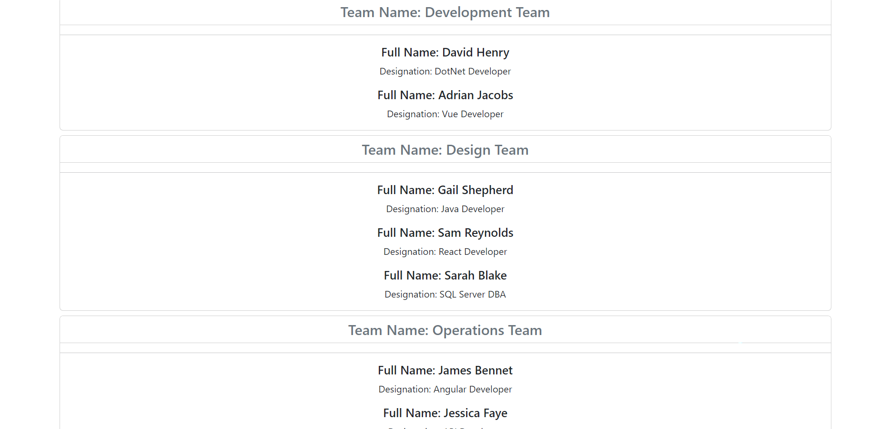

# Gerenciamento de Equipes com React!!

#### Esse é um simples projeto React desenvolvido para... gerenciar equipes e seus membros de uma maneira simples e eficiente. Você lider de várias equipes que precisa alocar a realocar seus funcionários entre as equipes de Marketing, Desenvolvimento, Operações e Marketing? Esquece onde tal membro está alocado? Esse simples aplicativo torna tudo mais fácil!!



Em suma esse projeto consiste em duas páginas, uma onde todos os membros são mostrados em cards, com seus nomes e cargos e também uma caixa seletora de equipe, onde os membros da equipe selecionada serão delienados e que com simples cliques pode-se alterar os membros da equipe selecionada. E outra página onde é mostrado um quadro com as quatro equipes e seus membros!

_Página de seleçao:_



---

_Página de times:_


Para o roteamento das páginas utilizei a biblioteca `React Router` que torna bem simples o roteamento de páginas dentro do ecossistema React, utilizando os componentes `<Route />` com o componente alvo como atributo.
```
      <Routes>
        <Route path="/"
          element={<Employees employees={employees}
            selectedTeam={selectedTeam}
            handleEmployeeCardClick={handleEmployeeCardClick}
            handleTeamSelectionChange={handleTeamSelectionChange}
          />}>

        </Route>
        <Route path="/GroupedTeamMembers" element={<GroupedTeamMembers employees={employees}
          selectedTeam={selectedTeam} setTeam={setTeam} />}>
        </Route>
        <Route path="*" element={<NotFound />}>
        </Route>
      </Routes>
```

Ou seja, no caminho "/", me é retornado o elemento `<Employees />`, e no caminho "/GroupedTeamMembers" me é retornado o elemento `<GroupedTeamMembers />`. Para navegar entre os caminhosa utilizei a tag `<Link>` com o atributo `to=`:
```
    <nav className='navbar navbar-expand-lg navbar-light bg-light'>
      <ul className='navbar-nav me-auto mb-2 mb-lg-0'>
        <li className='nav-item'>
          <Link className='nav-link' to='/'>Home</Link>
        </li>
        <li className='nav-item'>
          <Link className='nav-link' to='/GroupedTeamMembers'>Teams</Link>
        </li>
      </ul>
    </nav>
```

Simples assim temos uma navegação multipágina!! 

#### Agora sobre como a funcionalidade do aplicativo foi implementado foi bem simples:

Dentro do `<App />` dois states, `selectedTeam` e `employees` são definidos, onde o primeiro armazena qual o time selecionado, e o segundo armazena todos os funcionários com suas respectivas características, em um array de objetos.

Além disso funçôes são implementadas para lidar com nova seleção de time e rearranjo de funcionários.
```
  function handleTeamSelectionChange(e) {
    setTeam(e.target.value)
  }
  function handleEmployeeCardClick(e) {
    const transformedEmployees = employees.map((employee) => employee.id === parseInt(e.currentTarget.id) ? (employee.teamName === selectedTeam) ? { ...employee, teamName: '' } : { ...employee, teamName: selectedTeam } : employee)
    setEmployees(transformedEmployees)
  }
```
Os cards são renderizados utilizando o método `map()`, tornando o código mais legível e de mais fácil manutenção também!

Para fitrar os membros no time selecionado foi utilizado a função built-in `filter()`.

Com esse projeto meu aprendizado principal foi a introdução ao React Router e algumas de suas funcionalidades. E claro além disso vários conceitos já vistos de hooks e lidar com eventos foram mais bem estruturados.

Foi sim um grande desafio lidar com tantos eventos diferentes, mas graças ao grande poder do React, no final tudo se termina de maneira simples e fácil de entender!

Veja esse projeto live abaixo:
[Live](https://gerenciamento-equipes-epiuwkw7k-lucas-vieira-r.vercel.app)

