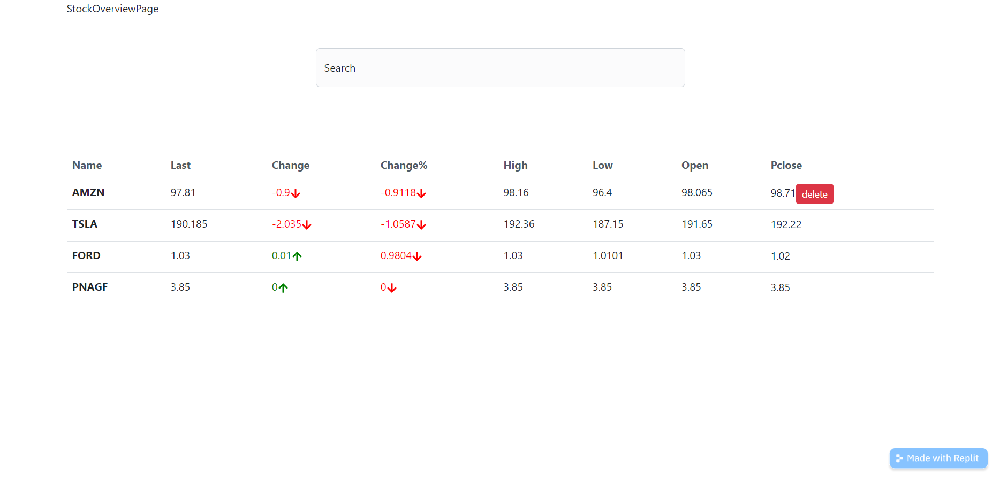
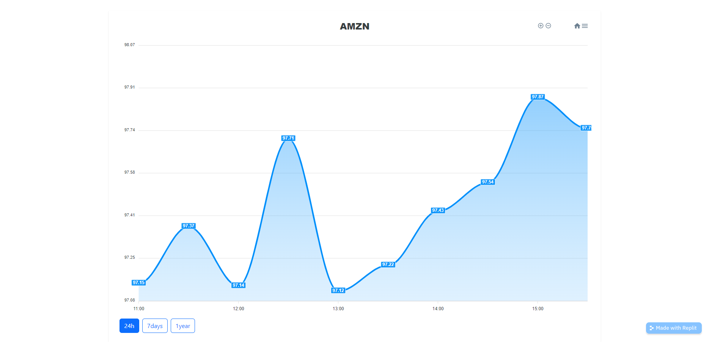

# Portal Financeiro

### Um projeto onde você pode se inteirar sobre os dados das suas ações de escolha, com um mecanismo de busca e páginas com mais informações detalhadas sobre a ação, além de um gráfico por periodo de tempo também selecionado pelo usuario.



Esse Projeto consome a API [Finnhub](https://finnhub.io) para requisitar os dados das ações, e me fez aprofundar com a biblioteca axios além da bilbioteca React Router!

Para as requisições, já que ia consumir diversas rotas dessa API, resolvi modulizar a função da API, que com a biblioteca axios e suas funcionalidades de parametros tornaria tudo mais fácil:
```
import axios from 'axios'

const TOKEN = 'cg2edo9r01qq9k4992agcg2edo9r01qq9k4992b0'

export default axios.create({
  baseURL:'https://finnhub.io/api/v1',
  params:{
    token:TOKEN
  }
})
```
Fiz o uso também da Context API para definit um state das ações que o usuário quer receber informações, que persiste no navegador com LocalStorage:
```
  const items = localStorage.getItem("watchList")
  const [watchList, setWatchList] = useState(items?items.split(','):["AMZN","TSLA"]);
  const addStock = (stock) => {
    if (!watchList.includes(stock)) {
      setWatchList([...watchList, stock])
      localStorage.setItem("watchList", [...watchList, stock])

    }
  }
  const deleteStock = (stock) => {
    setWatchList(watchList.filter((el) => {
      return el !== stock
    }))
    localStorage.setItem("watchList", [watchList.filter((el) => {
      return el !== stock
    })])}

```
Usei o React Router para definir o roteamento de duas páginas, a página principal, e a página específica de cada ação, onde passo como parametro a sigla dele, para o consumo de mais dados daquela ação específica com a função `useParam()` do react router.
Dentro dessa página utilizei a biblioteca **ApexCharts** para construir um gráfico com os dados obtidos da API, após uma formatação:

```
  useEffect(() => {
    const fetchData = async () => {
      const date = new Date()
      const currentTime = Math.floor(date.getTime() / 1000);
      let oneDayAgo;
      if (date.getDay() === 6) {
        oneDayAgo = currentTime - 24 * 60 * 60 * 2;
      } else if (date.getDay() === 0) {
        oneDayAgo = currentTime - 24 * 60 * 60 * 3;
      } else {
        currentTime - 24 * 60 * 60;
      }
      const oneWeekAgo = currentTime - 24 * 60 * 60 * 7;
      const oneYarAgo = currentTime - 24 * 60 * 60 * 365;

      try{
        const responses = await Promise.all([finnHub.get("/stock/candle", {
        params: {
          symbol: symbol,
          from: oneDayAgo,
          to: currentTime,
          resolution: 30
        }
      }), finnHub.get("/stock/candle", {
        params: {
          symbol: symbol,
          from: oneWeekAgo,
          to: currentTime,
          resolution: 60
        }
      }), finnHub.get("/stock/candle", {
        params: {
          symbol: symbol,
          from: oneYarAgo,
          to: currentTime,
          resolution: "W"
        }
      })])
      
      setChartData({
        day:formatData(responses[0].data),
        week:formatData(responses[1].data),
        year:formatData(responses[2].data)
      })
      }catch(err){
        console.log(err)
      }

    }
    fetchData()
  }, [symbol])
```
E é simples assim construir um gráfico histograma com o ApexCharts.



Para o roteamento, ao invés de usar o componente `<Link />`, utilizei a função `navigate()`, facilitando o uso de parametros, para o acesso da API subsequente.

Para o mecanismo de pesquisa que autocompleta com sugestões, uitlizei as classes collapse do bootstrap juntamente com uma lógica de checagem de um input controlado, que chama uma rota da API com o state como parametro, e retorna os matches da pesquisa em uma lista.
```
  const [search, setSearch] = useState('')
  const [results, setResults] = useState([])
  const { addStock } = useContext(WatchListContext)

  const showDropdown = () => {
    const dropDownClass = (search ? "show" : null)
    return (
      <ul style={{ height: '500px', overflowY: 'scroll', overflowX: 'hidden', cursor: 'pointer' }} className={`dropdown-menu ${dropDownClass}`}>
        {results.map((item) => {
          return (
            <li onClick={() => {
              addStock(item.symbol)
              setSearch('')
            }} key={item.symbol} className='dropdown-item'>{item.description}({item.symbol})</li>
          )
        })}
      </ul>
    )
  }

  useEffect(() => {
    let isMounted = true
    const fetchData = async () => {
      try {
        const response = await finnHub.get("/search", {
          params: {
            q: search
          }
        })

        setResults(response.data.result)
      } catch (err) {
      }
    }
    if (search.length >= 1) {
      fetchData()
    } else {
      setResults([])
    }
    return () => (isMounted = false)
  }, [search])
```

Aprender mais funcionalidades da biblioteca Axios e como trabalhar com parametros, assim como aprender mais funções do react router, também trabalhando com parametros foi uma experiencia inestimavel, e além disso colocar todos os outros conceitos do react em prática, como hooks, entender o ciclo de vida etc... tudo isso colabora para meu aprendizado como desenvolvedor e espero que possa colaborar com você também. Aprender a trabalhar com nocas bibliotecas e aprende-las com suas documentações ajuda tremendamente a ter o famoso _Big Picture_ das aplicações web.


Voce pode ver esse Projeto em produção no link abaixo:

[Portal financeiro]()


