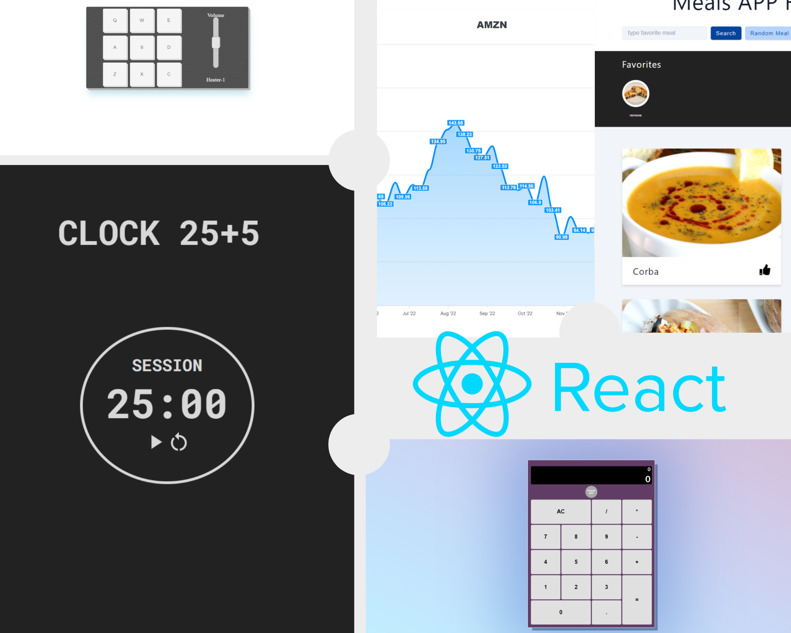

# React.JS
O ReactJS é uma biblioteca Javascript para a criação rápida e dinâmica de interfaces de usuário. Prometendo agilizar o processo de tornar interfaces dinâmicas, o React dominou o mercado da tecnologia por ser prático, rápido de aprender e escalável, por permitir a reutilização de componentes.
Como seu princípio fundamental, o React permite a sincronização rápida de elementos sem a necessidade de atualizar a página por exemplo.

---

## Meus Projetos concluídos:
##### Esse repositório tem como um dos seus papéis mostrar todos meus projetos já realizados utilizando a biblioteca React em conjunto com outras, e o que eu aprendi desenvolvendo cada um deles. Clique no link para mais detalhes de cada projeto:

#### 1.[Visualizador Markdown](https://github.com/Lucas-Vieira-R/ReactJS_Journey/tree/main/1-Visualizador_Markdown)
&nbsp;&nbsp;&nbsp;Meu primeiro projeto em React, ainda utilizando componentes de classe. Sua funcionalidade é receber um input de texto, convertê-lo para Markdown e mostrá-lo ao usuário.

#### 2.[Bateria Eletrônica](https://github.com/Lucas-Vieira-R/ReactJS_Journey/tree/main/2-Bateria_eletronica)
&nbsp;&nbsp;&nbsp;Implementando os componentes funcionais, construí essa bateria com regulagem de volume, e toca com cliques ou teclas, mostrando o som tocado no display.

#### 3.[Calculadora](https://github.com/Lucas-Vieira-R/ReactJS_Journey/tree/main/3-Calculadora_react) 
&nbsp;&nbsp;&nbsp;Um projeto mais limpo e modularizado, com varios componentes. Uma caluladora completamente funcional, com função de sons ao teclar. 

#### 4.[Relógio Pomodoro](https://github.com/Lucas-Vieira-R/ReactJS_Journey/tree/main/4-Pomodoro_app)
&nbsp;&nbsp;&nbsp;Com toda certeza o projeto que eu mais gostei de desenvolver, um App Pomodoro ajustável completamente funcional, com dark/light mode implementado e animações. Me introduziu ao Context API para evitar Prop Drilling e deixar tudo mais organizado.

#### 5.[Gerenciamento de Equipes](https://github.com/Lucas-Vieira-R/ReactJS_Journey/tree/main/5-Gerenciamento_equipes)
&nbsp;&nbsp;&nbsp;Um projeto simples, mais para a prática onde consolidei as funcionalidades básicas do react e me introduziu ao React Router.

#### 6.[Portal de Receitas](https://github.com/Lucas-Vieira-R/ReactJS_Journey/tree/main/6-Portal_receitas)
&nbsp;&nbsp;&nbsp;Construído de maneira completamente dinâmica através de dados de uma API, esse projeto também foi divertido de connstruir, utilizando a biblioteca Axios para o consumo da API de receitas.

#### 7.[Portal Financeiro](https://github.com/Lucas-Vieira-R/ReactJS_Journey/tree/main/7-Portal_financeiro)
&nbsp;&nbsp;&nbsp;Uma caixa de pesquisas para buscar ações através de uma API. Uma tabela com os dados de ações escolhidas pelo usuário que persiste no Local Storage e um roteamento para outra página com um gráfico do determinado ativo. Um projeto desafiador onde consolidei tudo o que aprendi nos projetos acima, juntando tudo em um só projeto.  

  
  ---

  
  ---


  


### Veja os projetos em sua máquina:
*Você pode clonar esse repósitorio para rodar os projetos no seu ambiente local, basta abrir um terminal na pasta do projeto que quer visualizar e seguir os passos:*  
>    1. #### **`npm install`**
>    2. #### **`npm run dev`**
*Agora só abrir em seu navegador o localHost informado.*
  
  ---


## Entenda o básico do React:
Antes de mais nada, o React é super bem documentado e eu diria que é completamente possível aprender todas suas funcionalidades através da sua -> **[Documentação](https://pt-br.reactjs.org/docs/hello-world.html)** <-.
(Inclusive eu estou usando o material contido na documentação para escrever essa parte. Valeu Meta!)
(Sério a documentação é excelente, vai lá! )

#### JSX
O react utiliza a a extensão de sintaxe JSX, que é como uma fusão de Javascript com HTML. E o JSX por si só já garante funcionalidades interessantes como por exemplo:
```
const nome = "Lucas Vieira"
const meuJSX = <h4>Hello {name}</h4>
```
*As chaves são utilizadas dentro do JSX para indicar que o conteúdo não é literal e sim javascript, podendo ser variáveis, funções etc...
Se eu renderizar o componente meuJSX (são chamados de componentes), isso seria mostrado:
>    #### Hello Lucas Vieira

Um detalhe que já acho importante especificar aqui é que os componentes JSX só podem devolver uma tag HTML. Mas você pode adicionar tags filhas como por exemplo:
```
   const tag =  <Div>
                    <h2>Title</h2>
                    <p>paragraph</p>
                </div>;
```

#### Componentes React:

Inicialmente os componentes React foram construídos em cima das classes ES6 do javascript:
```
class Welcome extends React.Component {
  render() {
    return <h1>Olá, {this.props.name}</h1>;
  }
}
```
Mas também pode ser definido através de função, como na função `Welcome()` abaixo.
Quando o React vê um elemento representando um componente definido pelo usuário, ele passa atributos JSX e componentes filhos para esse componente como um único objeto. Nós chamamos esse objeto de “props”.
Por exemplo, esse código renderiza “Olá, Sara” na página:
```
function Welcome(props) {
  return <h1>Olá, {props.name}</h1>;
}

const root = ReactDOM.createRoot(document.getElementById('root'));
const element = <Welcome name="Sara" />;
root.render(element);
```

#### State e Ciclo de vida:
##### State:
 
Aqui é onde eu diria que a mágica do React começa. Os componentes React podem ter propriedades mutáveis chamadas State, e essas propriedades podem ser renderizadas e _**re-renderizadas quando mudam.**_ E isso é alcançado através do hook `useState()`, que substitui o this.state em componentes de classe.

_*Vamos continuar agora somente com os componentes funcionais (de função), pois os de classe já não são mais utilizados (além de serem beeem mais verbosos)._

Vamos criar um componente que mostra a data e hora local através do objeto `Date()`.
```
import {useState} from "react"

function displayDate(props){
    const data = new Date();
    const [stateDate,setDate] = useState()

    return(<h2>{stateDate}</h2>)

}
```
E o pulo do gato aqui é que sempre que a página for recarregada, a data vai mudar, e se por um motivo se utilizar o método `setDate()`, o componente é re-renderizado sem a necessidade de atualizar a página.

##### Ciclo de vida de componentes:

Os componentes React no navegador quando renderizados são montados, re-montados (ou atualizados) como vimos usando o useState e desmontados. E isso é chamado de ciclo de vida dos componentes.
E com isso nós podemos executar ações ou funções nesses momentos específicos de cada componente. Por exemplo eu posso querer que uma música toque quando um estado de data é atualizado para por exemplo o meu aniversário. Para isso utilizamos o hook `useEffect()`, que recebe como parametros uma função callback que queremos executar e um componente como dependencia.
Vamos continuar com o exemplo acima adicionando agora o useEffect que checa se a data nova é meu aniversario e toca uma musica:
```
import {useState, ueseEffect} from "react"

function displayDate(props){
    const data = new Date();
    const [stateDate,setDate] = useState()

    useEffect(()=>{
        if(stateDate==ehMeuAniversario()){
            playMusica();
        }
    },[stateDate])

    return(<h2>{stateDate}</h2>)

}
```
Com essa funcionalidade o céu é o limite para o que fazer, e como você pode ver, eu a utilizei em basicamente todos os meu projetos.

#### Context API

Essa funcionalidade além de tornar um projeto bem mais organizado em camadas, quase como um MVC me permita dizer (nao me julguem), trata de um problema recorrente (e tremendamente chato por requerer digitar muito mais código) do React: o prop Drilling!
Componentes podem conter outros componentes que podem conter outros componentes e por assim vai. Um exemplo, no projeto da calculadora o componente CalculatorApp contem os componentes Display e o ButtonsGrid (que contem os componentes buttons), e o state principal da calculadora juntamente com todas as suas funcionalidade como acrescentar, diminuir etc... é definido no CalculatorApp, o que me obriga a passá-los como props para todos os outros componentes, prop por prop, componente por componente. Chato.
O Context API permite que criemos um contexto onde toda a lógica pode estar inserido, e um componente que fornece esse contexto é colocado como pai de toda a aplicação:
```
<CalculatorContext.Provider values={add, minus, string, equal}>
    <CalculatorApp />
</CalculatorContext.Provider>
```
Entao eu posso passar como props dentro do CalculatorContext tudo que a aplicação vai precisar e interagir. E todos os filhos podem ter acesso a eles através do useContext():
```
const { add,minus,string,equal } = useContext(CalculatorContext)
```
E assim o problema do prop drilling é resolvido, além de deixar seu projeto bem mais elegante!

#### React Router


